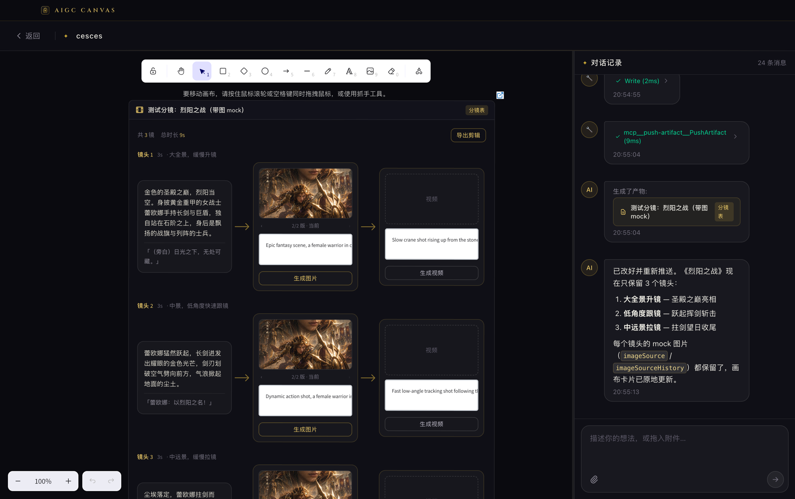

# AIGC CANVAS

English | [简体中文](README.zh-CN.md)

An Electron desktop workbench for AIGC creation: an infinite canvas (Excalidraw) on the left and a chat panel with a Claude Agent on the right. The agent reads/writes files inside the project workspace and pushes artifacts (Markdown / HTML / images / storyboards) onto the canvas. The headline capability is **AIGC short-drama storyboarding**: the agent generates a storyboard JSON and the canvas renders it as a visual per-shot pipeline card.



## Features

- **Agent chat**: powered by `@anthropic-ai/claude-agent-sdk` (claude_code preset) with Read/Bash/Glob/Grep/Edit/Write tools, scoped to the project workspace
- **Artifact canvas**: the agent pushes files via a custom `PushArtifact` tool; re-pushing the same file updates the existing card in place instead of adding a duplicate
- **Storyboard artifact**: `.storyboard.json` renders as a pipeline card (scene description → image node → video node) with:
  - **Editable** text-to-image / image-to-video prompts, saved back to the JSON source file on blur
  - `imageSource` / `videoSource` for the currently selected generation, `imageSourceHistory` / `videoSourceHistory` for re-roll history — browse versions and promote any of them to current
  - Generate buttons and export-edit entry (APIs pending, placeholders in place)
- **Canvas references**: clicking an artifact card adds a reference chip to the chat input; the agent knows which artifact the message modifies/references and can locate its file directly
- **Workspace protocol**: `workspace://<projectId>/<path>` lets HTML artifacts reference workspace assets (images, videos, css…) via relative paths
- **Persistence**: chat history and canvas snapshots are stored per project and restored on reopen; artifacts with a source file are re-read from disk on restore

## Tech Stack

Electron + React 19 + Vite + TailwindCSS v4 + Zustand + Excalidraw + claude-agent-sdk (custom tools via in-process MCP server)

## Quick Start

```sh
pnpm install
pnpm dev
```

Requires working Claude credentials on the machine (Claude Code login or `ANTHROPIC_API_KEY`); the Agent SDK picks them up automatically.

## Scripts

- `pnpm dev`: start the dev environment (Vite + Electron)
- `pnpm build`: build the renderer and package with electron-builder
- `pnpm test` / `pnpm test:e2e`: Vitest unit tests / Playwright e2e tests
- `pnpm typecheck`: TypeScript type check

## Project Structure

```tree
├── electron/
│   ├── main/
│   │   ├── ipc/                 # IPC handlers (project/chat/canvas/artifact)
│   │   └── services/
│   │       ├── agent/           # Agent SDK wrapper
│   │       │   ├── index.ts     #   runAgent: query loop, tool registration
│   │       │   ├── tools.ts     #   PushArtifact custom MCP tool
│   │       │   ├── prompts.ts   #   system/user prompt assembly
│   │       │   └── artifact.ts  #   artifact construction & push
│   │       ├── message-hub.ts   #   main → renderer event push
│   │       └── project.store.ts #   project index & chat history persistence
│   └── preload/                 # contextBridge electronAPI
├── src/
│   ├── components/
│   │   ├── CanvasArea.tsx       # Excalidraw canvas: artifact elements, snapshots, reference selection
│   │   ├── ArtifactRenderer.tsx # per-type artifact dispatch
│   │   ├── StoryboardCard.tsx   # storyboard card (pipeline layout, versions, prompt editing)
│   │   ├── ChatPanel.tsx        # chat panel
│   │   ├── ChatInput.tsx        # input box (attachments, artifact reference chips)
│   │   └── ChatMessage.tsx      # message bubbles (attachments, refs, artifacts, tool calls)
│   ├── stores/app.store.ts      # Zustand global state (messages, artifacts, references)
│   └── shared/                  # IPC channels & types shared by main/renderer
└── test/
```

## Core Flows

**Artifact push**: agent `Write`s a file → calls `PushArtifact{path,title}` → the main process infers the type from the extension (images become data URLs; `.storyboard.json` → storyboard; `.html` → html; everything else markdown) → IPC push → the store upserts by source path → the canvas inserts or updates the embeddable card in place → the push is also persisted in chat history for restore.

**Storyboard schema** (`StoryboardShot`, see `src/shared/ipc.types.ts`): `index`, `duration` (seconds), `scene`, `dialogue`, `camera`, `textToImagePrompt` / `imageToVideoPrompt` (English prompts, editable in the UI), `imageSource` / `videoSource` (current selection paths), `*History` (re-roll history).

**Artifact references**: selecting a card on the canvas records a reference in the store → it is inlined into the user prompt (title + workspace-relative path) → the agent edits the file with Read/Edit and re-pushes, updating the card in place.

**Edit write-back**: editing a prompt or switching versions in the storyboard card → `artifact:save` IPC writes the JSON back into the workspace (with path-escape validation).

## Roadmap

- Wire up text-to-image / image-to-video APIs (buttons and data fields are ready: generate → download into the workspace → move old source into history → write the new path to source)
- Export edit (concatenate per-shot videos)
