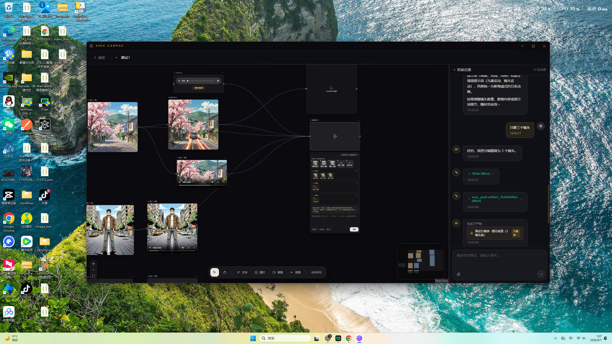
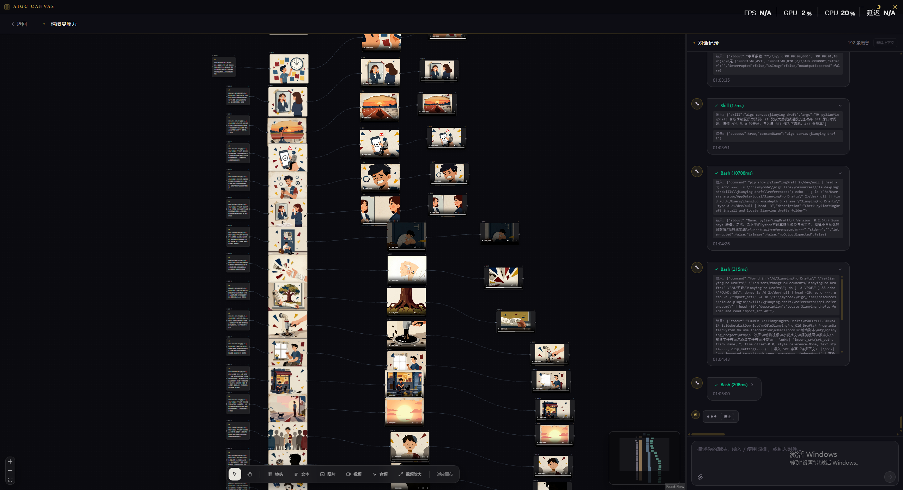

# AIGC CANVAS

简体中文 | [English](README.en.md)

AIGC CANVAS 是一个面向 AI 分镜与视频创作的 Electron 桌面工作台。它将 Claude Agent、React Flow 无限画布和 ComfyUI 生成管线放在同一个项目工作区中：通过对话生成分镜，在画布上连接文本、图片、视频与音频节点，并直接完成图片和视频生成。

## 创作工作区

在同一张无限画布上组织镜头、参考图片、生成视频与放大结果；右侧 Agent 对话会显示 Skill 和工具执行过程，并可直接读取、创建和修改画布节点。

## 核心能力

- **Agent 项目助手**：基于 @anthropic-ai/claude-agent-sdk，可实时读取画布并通过 Canvas MCP 工具创建、修改、删除和连接节点。
- **内置 Agent Skill**：以内置本地 Claude Plugin 随应用发布；仍支持项目自己的 `.claude/skills`，应用不会创建或覆盖其中的文件。
- **旁白配视频工作流**：根据旁白音频和 SRT 时间轴创建“镜头 → 图片 → 视频”节点，并逐段对齐后生成剪映草稿。
- **Skill 斜杠菜单**：在对话输入框开头输入 `/` 即可搜索 Skill，支持鼠标或方向键选择，选中后继续补充任务说明。
- **明确的上下文边界**：可从对话标题栏新建 Claude 上下文，旧聊天、画布状态和项目文件继续保留，并以分界线标识。
- **节点引用对话**：选中画布节点后点击“添加到对话”，即可把节点作为附件发送给 Agent，并按节点 ID 精确修改其内容和参数。
- **React Flow 无限画布**：支持缩放、平移、框选、多选、拖拽、删除和贝塞尔连接线，画布快照按项目持久化。
- **多种节点**：支持镜头、文本、图片、视频、音频和视频放大节点；镜头节点只记录镜头号和内容，生成提示词与时长由图片/视频节点负责；音频节点可上传并预览本地音频。
- **节点化分镜流水线**：Agent 直接创建“镜头 → 图片 → 视频”节点链，画布节点是分镜数据的唯一来源。
- **ComfyUI 图片生成**：支持文生图、图生图、16:9 / 1:1 / 4:3 画幅以及 RTX 2× ULTRA 放大。
- **MiniMax H3 文生视频 / 首尾帧视频**：连接的图片会进入候选集，可拖入明确的首帧和尾帧槽位；两个槽位均可选，也支持只设置其中一个。
- **MiniMax H3 全模态参考视频**：可将连接的素材拖入有序的图片轨、视频轨和音频轨。轨道顺序直接对应提示词中的 `<Picture n>`、`<Video n>`、`<Audio n>`，上限分别为 9 张图片、3 个视频和 3 段独立音频。
- **RTX 视频放大**：视频放大节点支持 2× / 3× / 4× 和 FAST / MEDIUM / HIGH / ULTRA 质量档位，输出帧率自动跟随源视频。
- **媒体预览**：图片直接展示，生成的视频可以在画布节点内播放；工作区协议支持视频 Range 流式读取。
- **系统配置**：可配置 ComfyUI 地址、Agent API 地址与 Token，以及默认文生图工作流。Token 使用 Electron 系统安全存储加密。
- **项目持久化**：聊天记录、画布布局、节点参数和生成产物均按项目保存。

## 创作流程

1. 新建项目并选择本地工作目录。
2. 在右侧对话中让 Agent 创建分镜；Agent 会直接批量创建镜头、图片和视频节点。
3. Agent 自动建立“镜头 → 图片 → 视频”的连接，也可以继续通过对话修改或重排节点。
4. 编辑图片提示词并选择工作流、画幅，点击“生成”。
5. 在视频节点中填写动作与运镜提示词；首尾帧模式可把连接图片拖入首帧/尾帧槽，全模态模式可把连接素材排列到三个参考轨道。
6. 生成文件保存在项目的 generated/images 和 generated/videos 目录。

## 内置 ComfyUI 工作流

| 工作流 | 类型 | RTX 放大 |
|---|---|---|
| Flux2 Klein 9B | 文生图 | 2× ULTRA |
| Flux2 Klein 9B Edit | 图生图 | 2× ULTRA |
| Z-Image Turbo | 文生图 | 2× ULTRA |
| MiniMax H3 | 文本 / 首尾帧生视频 | — |
| MiniMax H3 全模态参考 | 图片 / 视频 / 音频生视频 | — |
| RTX Video Super Resolution | 视频放大 | 2× / 3× / 4× |

工作流模板位于 resources/comfyui-workflows/。ComfyUI 服务端需要提前安装模板所使用的模型和自定义节点。

MiniMax H3 输出分辨率：

| 画幅 | 分辨率 |
|---|---:|
| 16:9 | 1024 × 576 |
| 4:3 | 1024 × 768 |
| 1:1 | 1024 × 1024 |

## 系统配置

首页右上角进入系统配置，可设置：

- ComfyUI HTTP 地址，例如 http://127.0.0.1:8188
- ANTHROPIC_BASE_URL
- ANTHROPIC_AUTH_TOKEN
- 默认文生图工作流

## 快速开始

环境要求：Node.js、pnpm、可访问的 ComfyUI 服务，以及 Claude Agent 凭证或兼容 Anthropic API 的 URL 与 Token。

~~~powershell
pnpm install
pnpm dev
~~~

生产构建：

~~~powershell
pnpm build
~~~

## 可用脚本

- pnpm dev：启动 Vite 与 Electron 开发环境
- pnpm build：构建并通过 electron-builder 打包
- pnpm typecheck：执行 TypeScript 类型检查
- pnpm test：执行 Vitest 测试
- pnpm test:e2e：执行 Playwright Electron 端到端测试

## 项目结构

~~~text
├── electron/
│   ├── main/
│   │   ├── ipc/                    # 项目、聊天、画布、产物、ComfyUI、配置 IPC
│   │   └── services/
│   │       ├── agent/              # Claude Agent SDK、Canvas MCP 与 PushArtifact
│   │       ├── comfyui.service.ts  # 图片/视频工作流与产物下载
│   │       ├── settings.service.ts # 全局配置与 Token 安全存储
│   │       └── project.store.ts    # 项目、聊天和画布持久化
│   └── preload/                    # electronAPI 安全桥接
├── resources/comfyui-workflows/    # ComfyUI API 工作流模板
├── resources/claude-plugin/        # 应用内置 Claude Plugin 与 Skill
├── src/
│   ├── components/CanvasArea.tsx   # React Flow 画布与生成节点
│   ├── pages/                      # 首页、项目页、设置页
│   ├── shared/                     # IPC 通道与类型
│   └── stores/                     # Zustand 状态
└── test/
~~~

## 分镜数据

镜头信息、提示词、生成产物路径和历史版本都直接保存在画布节点上。遇到旧版 `.storyboard.json` 产物时，应用会将其一次性迁移为“镜头 → 图片 → 视频”节点链。

## 后续规划

- **国产大语言模型**：接入 DeepSeek、Kimi、GLM 等模型，让用户可按任务选择不同的 Agent 推理服务。
- **AI 音乐创作**：增加配乐、歌曲与场景音乐生成能力，并与分镜、视频和时间线联动。
- **更多图片模型**：接入 Nano Banana、GPT Image 2、Seedream 等图片生成与编辑模型。
- **更多视频 API 模型**：接入 Seedance、可灵（Kling）、万相（Wan）等视频生成服务。
