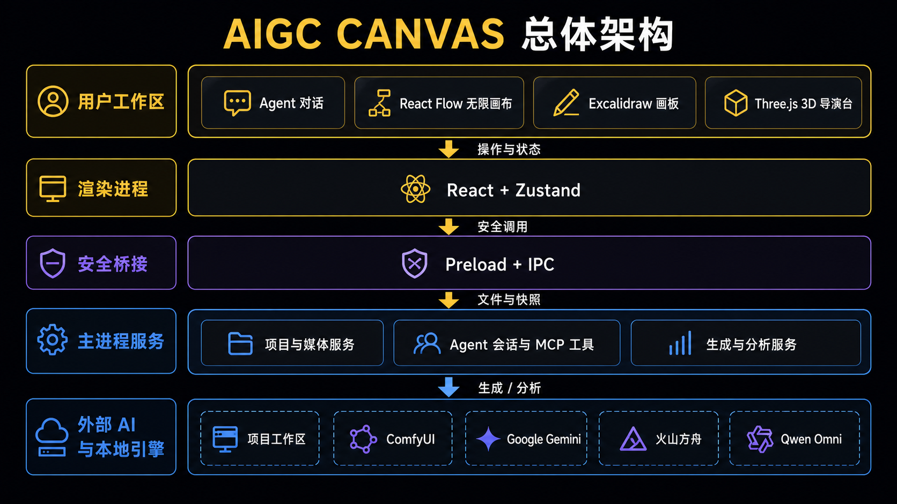
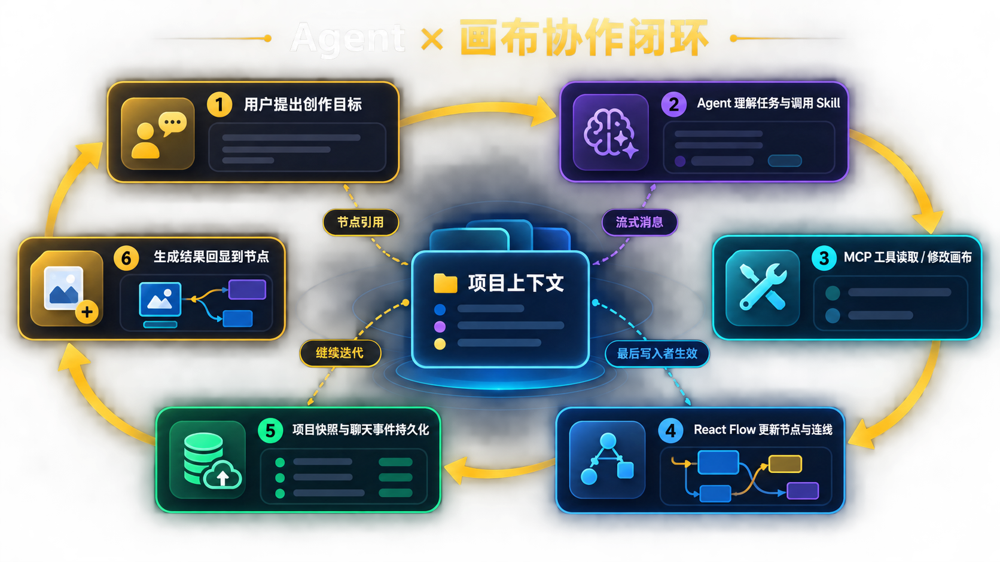
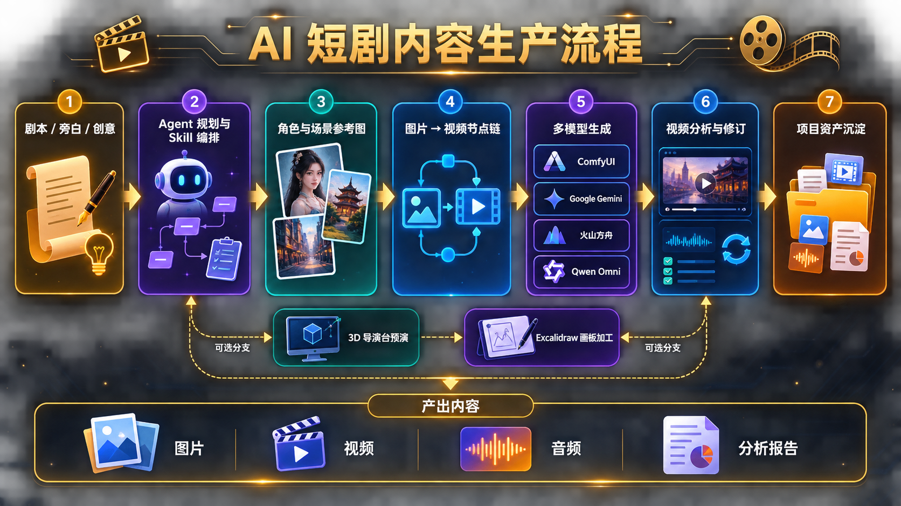
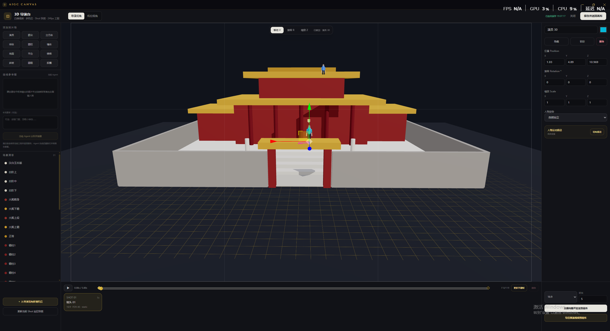
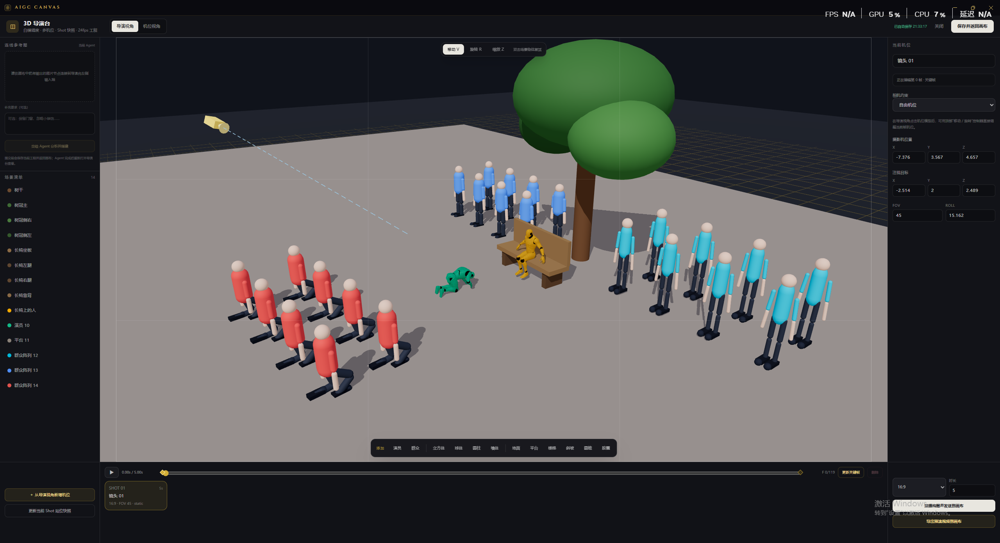
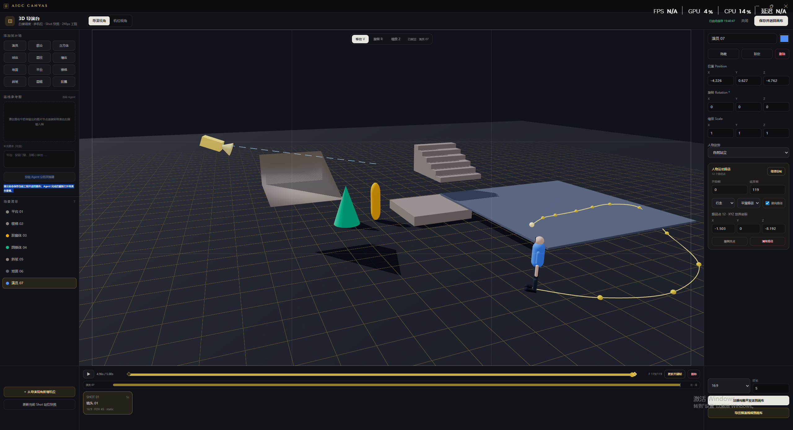
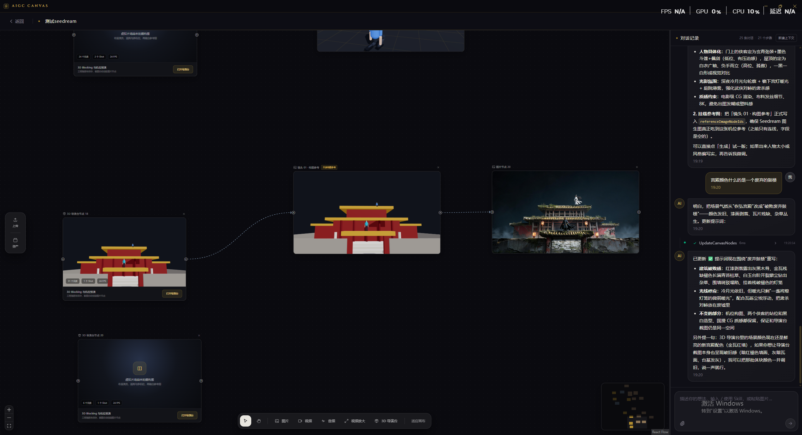

# AIGC CANVAS

简体中文 | [English](README.en.md)

AIGC CANVAS 是一个面向完整 AI 短剧生产闭环的 Harness Engineering 桌面工作台。用户输入剧本后，Agent 会为每个角色先生成唯一四联身份底图，再通过图生图派生不同场景/服装版本，同时生成无人俯视全景场景图，组织多模态参考并调用 ComfyUI 生成视频；需要时可按用户的具体问题分析实际视频。

## 架构概览

AIGC CANVAS 采用 Electron 分层架构：React 渲染进程承载 Agent 对话、无限画布、自由画板和 3D 导演台；Preload 与 IPC 提供安全桥接；主进程统一负责 Agent 会话、项目持久化、媒体处理以及生成与分析服务，并连接本地 ComfyUI 和云端 AI 服务。

Agent 通过内置 Skill 与 MCP 画布工具读取、创建和修改节点，React Flow 将结果更新到画布，聊天事件与画布快照再写回项目工作区，形成可持续迭代的协作闭环。

从剧本、旁白或创意出发，系统组织角色与场景参考、图片到视频的节点链、多模型生成、视频分析与修订，最终把图片、视频、音频和分析报告沉淀为可复用的项目资产。

## 创作工作区

在同一张无限画布上组织镜头、参考图片、生成视频与放大结果；右侧 Agent 对话会显示 Skill 和工具执行过程，并可直接读取、创建和修改画布节点。

## Claude Code 与 Codex

现在支持按项目选择 **Claude Code 或 Codex**。Claude Code 使用 `@anthropic-ai/claude-agent-sdk`，Codex 使用 `@openai/codex-sdk`；两者都可以通过 MCP 工具读取和修改画布，并支持流式对话、中断与会话恢复。

1. 先完成所选 Agent 的本机登录或认证配置。
2. 在首页点击“新建项目”，选择 **Agent 类型**（Claude Code / Codex）。
3. 等待模型列表加载后选择模型，也可沿用默认模型或输入自定义模型 ID；加载期间会显示转圈提示。
4. 填写项目名称、选择本地项目目录，然后创建项目。

Codex 运行中发送的新消息会显示在输入框上方的待发送列表，默认按顺序等待当前回合完成。点击某条右侧“立即发送”，会中断当前回合并在同一会话中优先处理该消息，其余消息继续排队。中断不会撤销已有修改或已提交的生成任务；普通“停止”会清空队列，重启应用也不会自动恢复待发送队列。

Agent 类型和模型随项目保存。历史项目继续使用 Claude Code；两种 Agent 的会话恢复 ID 分开存储。Codex 的思考强度沿用本机配置，目前弹窗尚未提供单独的强度选项。

设置页已移除 Agent API URL / Token 输入，认证改用各自的本机配置或进程环境变量；旧版应用内保存的 Claude 凭证不再注入会话。Codex 原生运行时随 SDK 平台依赖安装，安装时需保留 `optionalDependencies`，也可通过 `CODEX_EXECUTABLE` 指定可执行文件。

Codex 优先使用显式代理环境变量；未配置时，应用会解析系统代理并传给 Codex 子进程。本机画布 MCP 地址通过 `NO_PROXY` / `no_proxy` 绕过代理。修改代理后需重启应用；若仍出现 `Reconnecting…` 或请求超时，请检查代理节点和外网连接。

## 核心能力

- **剧本到 AI 短剧闭环**：从剧本解析、角色/服装资产、场景图、分镜到多模态视频生成，Agent 按生产阶段持续操作同一张画布。
- **角色与场景一致性资产**：每个角色先生成唯一横向四联身份底图，再以底图为单一参考通过图生图派生场景/服装版本；四联从左到右为头部近景、自然站立正面、侧面和背面。场景资产使用无人高机位俯视全景图。
- **Agent 项目助手**：按项目选择 Claude Code（@anthropic-ai/claude-agent-sdk）或 Codex（@openai/codex-sdk），通过轻量画布概览与按 ID 单节点详情工具精确读取上下文，并可创建、修改、删除和连接节点；写入按节点字段直接应用并采用最后写入者生效，不会因无关画布变化而失败。
- **内置 Agent Skill**：内置 Skill 随应用发布，Claude Code 通过本地 Plugin 加载，Codex 通过路径读取；支持 Claude 项目 `.claude/skills` 和 Codex 项目 `.agents/skills`，应用不会创建或覆盖其中的文件。
- **旁白配视频工作流**：根据旁白音频和 SRT 时间轴创建“图片 → 视频”片段链，并逐段对齐后生成剪映草稿。
- **Skill 斜杠菜单**：在对话输入框开头输入 `/` 即可搜索 Skill，支持鼠标或方向键选择，选中后继续补充任务说明。
- **聊天文件附件**：可给对话添加 txt、md、mp4、mp3 等任意普通文件；发送前文件会复制到项目工作区，再把可访问路径交给 Agent。也可直接粘贴 PNG、JPEG、WebP 或 GIF 图片并预览。
- **明确的上下文边界**：可从对话标题栏新建当前 Agent 上下文，旧聊天、画布状态和项目文件继续保留，并以分界线标识。
- **节点引用对话**：选中画布节点后点击“添加到对话”，即可把节点作为附件发送给 Agent，并按节点 ID 精确修改其内容和参数。
- **React Flow 无限画布**：支持缩放、平移、框选、多选、拖拽、删除和贝塞尔连接线，画布快照按项目持久化。
- **多种节点**：支持图片、画板、视频、音频、视频放大和 3D 导演台节点；生成片段直接由 video 节点承载，片段内生成 Shot 写入提示词；导演台另存可编辑的白模预演 Shot。
- **Excalidraw 自由画板**：画板无需输入即可打开并自由绘制；也可连入一个或多个已有输出的图片节点，将素材作为可选择、移动、缩放和旋转的普通图片载入。框选或 Shift 多选后右键导出，外部画布会自动新增相连的只读图片输出节点。
- **3D 导演台**：画布中的可编辑白模预演节点，覆盖基础搭景、人物调度、XYZ 空间路径、相机关键帧、人物跟拍、参考图 Agent 搭景、24fps 时间线、构图截图与 WebM 预演导出。详细能力见下方“3D 导演台”章节。
- **上传与项目资产**：左侧工具栏可上传本地图片、视频和音频并自动创建对应节点；资产面板集中查看当前项目生成及上传的素材，支持按类型筛选并拖拽回画布复用。
- **节点化生产流水线**：Agent 直接创建“参考图片 → 视频”节点链，画布节点是生产数据的唯一来源。
- **多模型图片生成**：ComfyUI 的 Krea 2 Turbo、Z-Image Turbo 当前仅支持 2K 文生图；Google Nano Banana 2 / Pro 支持最多 14 张有序参考图，Doubao-Seedream-5.0-pro / lite 支持最多 10 张有序参考图，覆盖 16:9 / 9:16 / 1:1 / 4:3。
- **MiniMax H3 文生视频 / 首尾帧视频**：连接的图片会进入候选集，可拖入明确的首帧和尾帧槽位；两个槽位均可选，也支持只设置其中一个。
- **MiniMax H3 全模态参考视频**：可将连接的素材拖入有序的图片轨、视频轨和音频轨。轨道顺序直接对应提示词中的 `<Picture n>`、`<Video n>`、`<Audio n>`，上限分别为 9 张图片、3 个视频和 3 段独立音频；生成时可选择标准 20 步工作流或带 Turbo 8 步 LoRA 的加速工作流。
- **Seedance 2.0 云端视频生成**：通过火山方舟 Agent Plan 生成 720p、4–15 秒同步音频视频，支持纯文本或最多 9 张图片、3 个视频、3 段音频的全模态参考；素材在提示词中按“图片1 / 视频1 / 音频1”引用，结果自动下载到项目目录。
- **通用视频分析**：Agent 可把项目内视频路径或公开 HTTP(S) 视频地址连同自定义分析要求交给 Qwen3.5-Omni Plus；工具顺序扫描完整画面与音轨，区分观察、转写和推断，为关键结论提供时间戳与不确定性说明，并保存 Markdown 报告。
- **RTX 视频放大**：视频放大节点支持 2× / 3× / 4× 和 FAST / MEDIUM / HIGH / ULTRA 质量档位，输出帧率自动跟随源视频。
- **媒体预览**：图片直接展示，生成的视频可以在画布节点内播放；工作区协议支持视频 Range 流式读取。
- **系统配置**：宽屏分组展示基础服务与 AI 云服务；可配置 ComfyUI、Google AI、火山方舟 Seedream/Seedance（含 Agent Plan）、Qwen3.5-Omni Plus 和默认生图模型。Google/Qwen 密钥使用 Electron 系统安全存储，方舟 Key 明文保存在本机设置。
- **项目持久化**：聊天记录、画布布局、节点参数和生成产物均按项目保存；返回或退出前等待草稿落盘，保存失败可重试，损坏快照不会被空画布静默覆盖。
- **生成任务恢复**：返回项目后恢复已有 ComfyUI/Seedance 任务的查询与下载；输出先关联并保存到画布，再确认完成。未知提交须先核实服务端结果，避免重复生成。
- **撤销与工作区布局**：画布与导演台均支持会话内撤销/重做；聊天和导演台侧栏可收起，为窄窗口保留编辑空间。

## 保存与生成任务

画布自动保存会显示等待、保存中、已保存或失败状态。“已保存”表示对应快照已写入项目目录。返回首页、关闭编辑器和退出应用前会刷新最后一次草稿；保存失败时保留当前内容并提示重试。损坏或无法读取的画布快照会暂停自动保存并保留原文件。

“生成任务”面板显示提交、生成/恢复、完成、失败和待核实状态。ComfyUI 与 Seedance 的远端任务 ID 会持久化；返回项目或重启后重新打开项目时，使用当前服务配置继续查询原任务并下载产物。网络波动时重试查询不会直接提交第二次生成。产物关联到原节点并保存成功后才确认任务，提取音频也会检查源视频并避免重复创建节点。

如果提交后没有拿到明确结果，面板会显示“提交结果待核实”。先在对应服务核实任务未继续执行，或已取回结果，再点击解除限制并确认；之后点击生成才会提交新任务。解除限制不会取消远端任务。Google/Seedream 的已完成图片也可在返回页面后自动关联，但同步请求中断且未取得结果时没有可恢复的远端任务 ID，不能自动重新提交。

画布工具栏支持撤销/重做，也可使用 `Ctrl/Cmd+Z`、`Ctrl/Cmd+Shift+Z`。画布最多保留 40 步会话内编辑历史，拖动合并为一步；撤销节点编辑不会再次调用生成接口，现有节点的最新生成结果会保留。历史不跨应用重启保存。

聊天回复按消息 ID 更新，历史加载会合并期间收到的新回复。发送失败保留正文与附件供重试；长聊天先显示最近 100 条，可分批加载更早消息并保持阅读位置。聊天面板可收起，拖动宽度会随窗口约束并记住设置。资产面板在视区附近按需生成图片缩略图与视频封面，限制并发并复用内存缓存。

设置仍通过顶部“保存配置”统一保存。未保存的修改会在返回时提供保存、放弃或继续编辑，直接退出也会提示先处理草稿。

## 画板节点

画板节点是可独立使用的 Excalidraw 工作区，创建后无需连接任何输入，点击“打开画板”即可从空白画布开始绘制。绘制元素、连接图片的变换和安全的画板设置会自动保存到节点的 `boardState`，关闭或重启项目后再次打开可继续编辑。关闭画板时会截取当前可视区域中心的 16:9 画面保存到 `.aigc-line/board-previews/`，节点卡片优先显示这张中心预览；首次尚未产生截图时才显示输入图片网格或空白提示。也可以将一个或多个已有 `sourcePath` 的图片节点连接到它，连接图片会同时出现在工作区中，并保持普通图片元素的选择、移动、缩放和旋转能力。

画板支持自由画笔、橡皮擦、矩形、圆形、箭头、连线和文字等 Excalidraw 工具。画板打开期间 Delete/Backspace 只作用于 Excalidraw 元素，React Flow 会拒绝节点删除。600ms 防抖自动保存场景，关闭时同步刷新最后一次修改；图片二进制不会以 data URL 写入画布快照，连接图片会在重开时从项目路径重建。需要输出时，先框选或按 Shift 多选绘制内容、图片与标注元素，再右键选择“导出所选素材”。应用会把所选元素合成为 PNG，写入 `generated/image-edits/`，随后在外部 React Flow 画布创建一个只读图片节点，并自动连接为“画板节点 → 导出图片节点”。同一编辑会话可重复导出多个不同组合；右上角不提供整张工作区保存按钮。

连接素材逐项加载，单张坏图会显示名称、占位和重试，其余素材与已保存绘图仍可编辑；编辑过程中连线、断开或重新生成的图片也会同步。交互使用降采样预览，导出按选区重新读取需要的图片；超过 8192px 边长或约 1678 万总像素的选区会先等比缩小，再创建 PNG，并显示实际输出尺寸。

## 3D 导演台

3D 导演台用于在正式图片和视频生成前完成低成本的空间验证：先用白模确认场景体量、人物站位、行走路线、镜头位置和画幅，再把构图截图作为画布参考继续生成。导演工程直接保存在 `director` 节点中，不依赖外部 DCC 软件。导演台打开期间按 Delete/Backspace 不会穿透到 React Flow 删除底层导演台节点。

上图展示了多人站位、群演阵列、不同人物动作、骨骼角色、基础几何搭景、机位轨迹，以及从左侧栏移到视口底部的素材工具栏。

### 工程与工作区

- 新建导演工程默认不放置演员或道具，只保留一个可用的 Shot 和机位。
- 工程固定使用 24fps，包含全局元素清单、当前 Shot、人物路径、相机关键帧和相机约束；所有 Shot 共享同一套人物与道具布局。
- 支持导演视角与机位视角切换；导演视角用于搭景和调度，机位视角显示最终取景。
- 支持 16:9、9:16、4:3、1:1 画幅。画幅裁切框同时用于预览、PNG 构图和 WebM 预演，保证输出范围一致。
- 参考栏、属性栏和时间线可以分别收起；窄窗口默认收起参考栏，便于观察场景。
- 导演台提供最多 60 步独立的会话内撤销/重做，覆盖场景、人物路径和机位修改，变换拖拽结束后记为一步；播放帧与 Shot 导航不计入历史，已完成截图记录会保留。
- 使用严格的可序列化 v2 schema；不会把 Three.js 对象、Blob URL 或临时渲染状态写进项目。旧 v1 导演工程不迁移，直接回退为空的 v2 工程。

### 基础素材与场景编辑

| 类型 | 用途与默认形态 |
|---|---|
| 演员 | 可替换的 UE 骨骼白模或轻量白模，支持体型、动作和 Shot 内空间路径 |
| 群众 | 可调整行列数与间距的白模阵列 |
| 立方体 / 球体 / 圆柱 / 墙体 | 通用建筑、家具、柱体和占位体块 |
| 地面 | 大面积薄型可行走表面 |
| 平台 | 舞台、台基、高台和建筑基座 |
| 楼梯 | 六级程序化踏步，每一级都可用于空间路径表面取点 |
| 斜坡 | 真实楔形几何，可用于坡道、屋面和倾斜结构 |
| 圆锥 / 胶囊体 | 标记物、雕塑、装饰物和特殊体块 |
| 门框 / 窗框 | 保留真实开口，窗框可通过位置 Y 指定窗台高度 |
| 桌子 / 椅子 | 带桌面、桌腿、椅背的整体白模，用于对话、办公与用餐场景 |
| 沙发 / 床 / 柜子 | 带靠背扶手、床头或柜门分隔的室内家具，整体调整尺寸与位置 |
| 栏杆 | 带立柱与扶手，杆间真实留空，适合走廊、阳台与围挡 |

所有场景元素都支持位置、旋转、缩放、颜色、显隐、锁定与删除。基础几何以底面为锚点：`scale.y` 是完整高度，`position.y` 是底面离地高度。Agent 搭景中的 `ground` 元素会强制贴到 `Y=0`，屋顶、横梁和招牌等 `elevated` 元素保留指定高度。

点击导演视角底部、时间线上方的“素材库”，可按人物、基础几何、建筑、家具分类浏览 20 种素材，也可按名称、英文 kind 或用途搜索。卡片显示图标及默认宽 × 高 × 深（米）；点击添加后自动收起，按 Escape 或点击外部也可收起。窄窗口下素材面板和分类可滚动；机位视角会隐藏素材库，拍摄、导出或绘制人物路径期间禁用。左侧栏只用于参考图、Agent 搭景要求和场景清单。

选中未锁定物体后可点击“复制”或按 `Ctrl/Cmd+D`，快速布置重复家具。副本使用独立 ID，沿 X 偏移 1 米，后续改动互不影响；复制演员不会复制原人物路径或机位引用。手工副本不会被参考图重新搭景删除。输入文字、变换拖动、拍摄/导出和路径绘制期间不会触发复制。建筑与家具模块的属性栏显示米制宽/高/深，窗框默认放在地面，安装到墙上时需调整位置 Y。

视口中的模型需要双击才会激活；单击不会抢走当前选中。激活后才显示 TransformControls，可使用顶部“移动 / 旋转 / 缩放”或快捷键 `V / R / Z`。控制器开始拖动后会锁定当前元素，防止相邻或后方模型因射线重叠而误选。左侧元素清单属于明确操作，仍可单击直接激活。

### 人物白模与姿势

主演默认使用真实 SkinnedMesh UE 骨骼白模，群众和加载失败兜底使用由球体、胶囊体、盒体及嵌套关节组成的轻量白模。两者共享体型与动作语义，并支持确定性时间线导出。

当前姿势包括：

- 自然站立
- 迈步行走
- 坐姿
- 抱臂
- 指向
- 单膝跪地
- 双手叉腰、挥手、举手、蹲下、前倾和回头

人物可以设置模型、体型、身高与颜色。群众可配置行、列和间距。两种人物模型都以鞋底为稳定的 Transform 与路径锚点，体型、姿势和身高变化不会改变路径坐标语义；骨骼模型的姿势直接作用于命名骨骼，当前仍不包含腿部 IK 或动作融合。

### XYZ 空间人物路径

人物路径属于具体 Shot，每个演员在一个 Shot 内最多一条路径：

- 按住 Ctrl 并用鼠标左键点击普通地面，生成 `Y=0` 的脚底路径点。
- 按住 Ctrl 并用鼠标左键点击楼梯、斜坡、平台或其他非人物基础几何表面，直接把 R3F 射线命中的 XYZ 世界坐标记录为脚底位置。
- 路径控制点支持 X/Y/Z 三轴拖动，右侧也可精确输入坐标。
- 支持折线路径和 Catmull-Rom 平滑路径。
- 支持设置开始帧、结束帧、行走、奔跑以及自动朝向路径。
- 播放、时间线拖动、相机跟随和 WebM 导出都按三维弧长进行恒速、确定性采样。
- 尚未添加有效第二点就结束绘制时，会自动清理占位路径，不会让工程进入不可保存状态。

这里采用的是手工指定的三维路线，不是 NavMesh 自动寻路。系统目前不会自动绕开障碍物，也没有楼梯 IK 或碰撞解算；需要由用户或 Agent 给出合适的空间路径点。

### 角色模型、体型与动作

- 主演员默认使用真实 SkinnedMesh 的“UE 骨骼白模”，每个实例通过 `SkeletonUtils.clone` 隔离骨架和材质；也可切换“轻量白模”。群众默认使用轻量白模，降低多人预演负担，GLB 加载失败时也会自动回退。
- 角色模型通过稳定的 `actorModelId` 注册，替换同骨架 GLB 无需改 Shot、路径或工程持久化结构。
- 内置标准、壮硕/胖、纤瘦、矮小和高大五种体型。UE 模型直接缩放骨盆、脊柱、锁骨、头部及四肢骨骼，轻量模型使用对应身体比例；两者都不是简单整体缩放。
- 体型会给出建议身高，也允许在 0.8–2.4 米范围内继续精调。
- 动作包括自然站立、行走、坐姿、抱臂、指向、单膝跪地、双手叉腰、挥手、双手举起、蹲下、前倾观察和回头。
- 演员进入路径有效区间后，行走/奔跑步态会暂时覆盖静态动作；停止后恢复所选动作。

UE 白模来自 William Luque 的 [UE Mannequin (Retopology)](https://sketchfab.com/3d-models/ue-mannequin-retopology-5394d9f894374a2ab7c57a21929ce4c2)，实现参考 [storyai-3d-director-desk](https://github.com/jiguang132/storyai-3d-director-desk)。源码参考项目是 MIT，但模型采用单独的 Sketchfab Standard License；原始来源和许可文件保存在 `public/models/`，分发时需一并保留。

### Shot、时间线与相机

- 每个 Shot 保存镜头时长、画幅、机位、FOV、Roll、相机关键帧和人物路径；人物与道具布局属于整个工程，切换 Shot 时保持不变。
- 底部采用剪辑软件式轨道布局：统一时间标尺和播放头对齐机位关键帧、人物动作片段，并显示 `分:秒:帧` 时间码、当前帧和 24fps 信息；可回到开头、逐帧前后移动、播放或拖动定位。
- 实时播放会在屏幕刷新间隔内使用小数帧平滑采样人物路径和相机；逐帧操作与 WebM 导出仍严格按 24fps 整帧求值，确保预演导出可重复。
- 时间线终点由 Shot 时长决定；缩短时长会同步裁剪越界的相机关键帧和人物路径范围。
- 相机关键帧支持 `hold`、`linear`、`smooth`、`ease-in`、`ease-out` 插值。
- 导演视角会显示当前 Shot 约束求值后的最终相机轨迹。
- 相机支持自由关键帧、锁定注视人物，以及按人物局部朝向偏移进行跟随。
- 求值顺序固定为“人物位置与朝向 → 自由相机曲线 → 注视/跟随约束”，因此人物运动与跟拍结果可重复。
- 机位视角支持 `W/S` 前进后退、`A/D` 左右移动、`Space` 上升、`Ctrl` 下降，以及按住鼠标左键拖动视线。
- 切换 Shot、保存、截图或导出前都会提交当前 Shot 的元素站位。

### Agent 与参考图搭景

只有连接到导演台输入端、且已有 `sourcePath` 输出的图片节点会进入参考图区域。编辑器直接显示这些图片的预览与名称，多图可切换；断开连线后对应参考图立即移除。

点击“交给 Agent 分析搭建”后：

1. 当前导演工程先保存。
2. 当前对话 Agent 使用自身的多模态能力读取所选图片，不调用独立视觉模型。
3. Agent 通过严格的 `apply-scene-draft` 动作写入最多 40 个可编辑体块。
4. 场景草案支持 `box / wall / cylinder / sphere / floor / platform / stairs / ramp / cone / capsule / doorframe / windowframe / table / chair / sofa / bed / cabinet / railing`。
5. 相同参考图重新搭建时，只替换该图生成且未锁定的几何，保留演员、手工元素、其他参考图几何和全部机位。

Agent 还可通过 `InvokeNodeAction` 原子执行 `add-element`、`add-shot`、`set-actor-path`、`set-camera-constraint` 和 `set-camera-keyframe`，无需为小改动重写完整导演工程。

### 自动保存与输出

- 元素、Shot、路径、相机和场景设置变化后，600ms 防抖提交，等待对应画布快照实际落盘后才显示已自动保存；失败保留草稿并提供重试。
- 顶部显示“等待自动保存 / 正在自动保存 / 已自动保存 / 保存失败”状态。
- 点击“保存并关闭”或提交 Agent 搭景前，会同步刷新最后一次草稿。
- 工程语义校验失败时拒绝保存，避免损坏数据覆盖有效快照。
- “拍摄构图”输出 PNG 到 `generated/director-stills/`，并创建与导演节点相连的只读图片节点。
- “导出预演视频”通过 WebCodecs 按 24fps 逐帧渲染和编码 WebM，保存到 `generated/director-videos/` 并创建相连的只读视频节点。慢渲染只会延长导出时间；支持进度、取消与超时，帧数不完整时拒绝保存，总时长包含最后一帧。单次最多 60 秒、编码数据最多 128MiB；需要运行环境支持 VP9 或 VP8 编码。
- 拍摄和导出期间冻结编辑，并复用同一画幅裁切区域与地面网格。
- 异步输出完成前会复核当前项目和源导演节点，避免项目切换后串写。

### 常用操作

| 操作 | 方式 |
|---|---|
| 激活场景物体 | 在视口中双击，或在左侧元素清单单击 |
| 取消激活 | 点击视口空白区域 |
| 移动 / 旋转 / 缩放 | `V / R / Z` |
| 撤销 / 重做 | `Ctrl/Cmd+Z` / `Ctrl/Cmd+Shift+Z`，或顶部按钮 |
| 复制选中物体 | `Ctrl/Cmd+D`，或属性栏“复制” |
| 绘制人物路径 | 选择演员 → “绘制路径” → 按住 Ctrl 并用鼠标左键点击地面或模型表面 |
| 精调路径高度 | 选中路径点后拖动 Y 轴，或编辑右侧 XYZ |
| 播放 Shot | 使用底部播放按钮或拖动时间线 |
| 新增机位 | “从导演视角新增机位” |
| 输出构图 / 预演 | “拍摄构图并发送到画布” / “导出预演视频到画布” |

## 创作流程

1. 在新建项目弹窗中选择 Claude Code / Codex、模型和本地工作目录。历史项目保持 Claude Code。
2. 提供剧本文件（也支持梗概、对白或创意），调用 `script-to-drama-video` Skill；主 Agent 按依赖调度资产、分镜师、检查三个独立子 Agent。
3. 资产 Agent 读取原剧本，调用人物/场景 Skill：先生成每个角色唯一的头部+正侧背四联底图和无人俯视场景图，再由底图图生图派生服装/状态版本；保留分阶段生成确认。核实画布资产后输出 `资产报告.md`，列出节点 ID、角色/场景版本、素材路径和可用状态。
4. 分镜师 Agent 读取原剧本与资产报告，深化戏剧节拍、拆分 5/10/15 秒片段、安排内部 Shot 和连续性，创建 video 节点及资产引用连线，逐片调用 `h3-prompt-writing` 写入最终提示词，输出 `分镜交接.md`。画布不创建独立分镜节点。
5. 检查 Agent 独立读取原剧本、报告与实际画布，检查人物/服装/场景引用、分段合理性与衔接、必要补镜和描述、H3 prompt 格式，输出每轮检查报告。未通过则退回优化、再检查；缺资产时先补资产并更新报告，全部通过后且已有用户明确生成授权才开始生成视频。
6. 资产、交接和每轮检查报告保存在项目 `generated/drama-reports/<本次任务标识>/`；`检查报告.md` 指向最新轮次。检查通过后内容变化须复查，未解决的阻塞不能跳过生成。
7. 主 Agent 等待生成完成并核对每个 video 节点的状态与产物路径；用户明确提出成片分析问题时，再调用通用视频分析工具。图片与视频保存在 `generated/images` 和 `generated/videos`；需要成片时可继续生成剪映草稿。

## 内置 ComfyUI 工作流

| 工作流 | 类型 | 输出 |
|---|---|---|
| Krea 2 Turbo | 文生图（当前不支持参考图） | 直接生成 2K |
| Z-Image Turbo | 文生图（当前不支持参考图） | 直接生成 2K |
| Nano Banana 2（Google API） | 文生图 / 最多 14 张有序参考图，2K | — |
| Nano Banana Pro（Google API） | 文生图 / 最多 14 张有序参考图，2K | — |
| Doubao-Seedream-5.0-pro（火山方舟 API） | 文生图 / 最多 10 张有序参考图，2K | — |
| Doubao-Seedream-5.0-lite（火山方舟 API） | 文生图 / 最多 10 张有序参考图，2K | — |
| Doubao Seedance 2.0（方舟 Agent Plan） | 文本 / 图片 / 视频 / 音频生视频，720p 同步音频 | — |
| MiniMax H3 | 文本 / 首尾帧生视频 | — |
| MiniMax H3 全模态参考 | 图片 / 视频 / 音频生视频 | — |
| MiniMax H3 全模态参考（加速 LoRA） | 图片 / 视频 / 音频生视频，Turbo 8 步 | — |
| RTX Video Super Resolution | 视频放大 | 2× / 3× / 4× |

工作流模板位于 resources/comfyui-workflows/。ComfyUI 服务端需要提前安装模板所使用的模型和自定义节点；加速全模态工作流还需要 `minimax_h3_fl2v_turbo_8step_v1.0_comfyui_bf16.safetensors` LoRA。H3 参考视频会同时使用画面和内嵌音轨；也可在已有输出的视频节点上点击“提取音频”，生成独立音频节点后放入单独音频参考轨。

图片输出分辨率：

| 画幅 | 分辨率 |
|---|---:|
| 16:9 | 2048 × 1152 |
| 4:3 | 2048 × 1536 |
| 1:1 | 2048 × 2048 |

MiniMax H3 输出分辨率：

| 画幅 | 分辨率 |
|---|---:|
| 16:9 | 1024 × 576 |
| 4:3 | 1024 × 768 |
| 1:1 | 1024 × 1024 |

## 系统配置

首页右上角进入系统配置，可设置：

- ComfyUI HTTP 地址，例如 http://127.0.0.1:8188
- Qwen3.5-Omni Plus OpenAI 兼容 API 地址和 DASHSCOPE_API_KEY
- Google AI Studio 的 GEMINI_API_KEY（Nano Banana 2 / Pro 共用），以及无法直连 Google 时使用的可选 HTTP/HTTPS/SOCKS 代理
- 火山方舟 ARK_API_KEY（Seedream 图片与 Seedance 2.0 视频共用）及可配置普通 API / Agent Plan Base URL
- 默认生图模型或工作流

## 快速开始

环境要求：Node.js、pnpm、可访问的 ComfyUI 服务，以及所选 Claude Code 或 Codex 的本机登录/配置。Codex SDK 的平台二进制随依赖安装，请保留 optionalDependencies。

~~~powershell
pnpm install
pnpm dev
~~~

生产构建：

~~~powershell
pnpm build
~~~

## 可用脚本

Windows 构建会在 `release/<版本>/` 同时生成两种 x64 程序：

- `AIGC CANVAS_<版本>_Setup.exe`：安装版，可选择安装目录。
- `AIGC CANVAS_<版本>_Portable.exe`：单文件免安装版，下载后双击运行。

免安装版的设置仍保存在系统用户数据目录，项目保存在你选定的目录。macOS 构建继续生成 `.dmg` 和 `.zip`。GitHub Actions 的 Windows 构建产物包含上述两种 EXE。

- pnpm dev：启动 Vite 与 Electron 开发环境
- pnpm build：构建并通过 electron-builder 打包
- pnpm typecheck：检查渲染进程、Electron 主进程与 preload 的 TypeScript 类型
- pnpm test：执行 Vitest 测试
- pnpm test:e2e：执行 Playwright Electron 端到端测试

## 项目结构

~~~text
├── electron/
│   ├── main/
│   │   ├── ipc/                    # 项目、聊天、画布、产物、ComfyUI、配置 IPC
│   │   └── services/
│   │       ├── agent/              # Claude Agent SDK / Codex SDK、Canvas MCP 与 PushArtifact
│   │       ├── comfyui.service.ts  # 图片/视频工作流与产物下载
│   │       ├── settings.service.ts # 全局配置与 Token 安全存储
│   │       └── project.store.ts    # 项目、聊天和画布持久化
│   └── preload/                    # electronAPI 安全桥接
├── resources/comfyui-workflows/    # ComfyUI API 工作流模板
├── resources/claude-plugin/        # 应用内置 Claude Plugin 与 Skill
├── src/
│   ├── components/CanvasArea.tsx   # React Flow 画布与生成节点
│   ├── pages/                      # 首页、项目页、设置页
│   ├── shared/                     # IPC 通道与类型
│   └── stores/                     # Zustand 状态
└── test/
~~~

## 生产数据

片段提示词、生成产物路径和历史版本都直接保存在 image/video 节点上。遇到旧版 `.storyboard.json` 产物或旧 shot 节点时，应用会迁移为“图片 → 视频”节点链并移除已废弃的 shot 节点。

## 后续规划

- **组合搭景**：计划增加可编辑的客厅、卧室、走廊预设，以及吸附、对齐、成组和批量排列；当前已提供 20 种标准素材与单物体复制，整套房间预设尚未实现。
- **国产大语言模型**：接入 DeepSeek、Kimi、GLM 等模型，让用户可按任务选择不同的 Agent 推理服务。
- **AI 音乐创作**：增加配乐、歌曲与场景音乐生成能力，并与分镜、视频和时间线联动。
- **更多图片模型**：继续接入 GPT Image 2 等图片生成与编辑模型。
- **更多视频 API 模型**：接入 Seedance、可灵（Kling）、万相（Wan）等视频生成服务。

## 视频时长

MiniMax H3 视频节点支持 1–15 秒整数时长，使用秒数输入框，支持直接输入与步进调整；失焦或按 Enter 时规范化到有效整数范围；显示、Agent 节点能力、旧节点载入与生成请求统一保留该范围内的时长，不再回退到 5/10/15 档位。Seedance 沿用当前生成服务的 4–15 秒范围。共享规则位于 `src/shared/video-duration.ts`。
