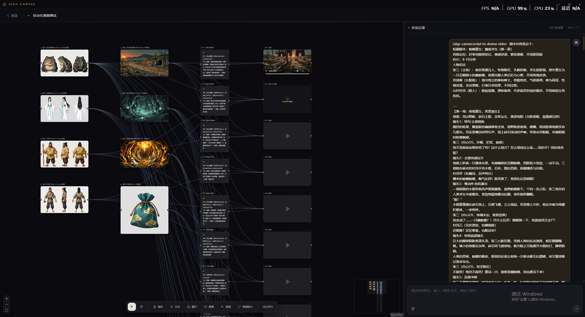

# AIGC CANVAS

简体中文 | [English](README.en.md)

AIGC CANVAS 是一个面向完整 AI 短剧生产闭环的 Harness Engineering 桌面工作台。用户输入剧本后，Agent 会为每个角色先生成唯一四联身份底图，再通过图生图派生不同场景/服装版本，同时生成无人俯视全景场景图，组织多模态参考并调用 ComfyUI 生成视频；需要时可按用户的具体问题分析实际视频。

## 创作工作区

在同一张无限画布上组织镜头、参考图片、生成视频与放大结果；右侧 Agent 对话会显示 Skill 和工具执行过程，并可直接读取、创建和修改画布节点。

## 核心能力

- **剧本到 AI 短剧闭环**：从剧本解析、角色/服装资产、场景图、分镜到多模态视频生成，Agent 按生产阶段持续操作同一张画布。
- **角色与场景一致性资产**：每个角色先生成唯一横向四联身份底图，再以底图为单一参考通过图生图派生场景/服装版本；四联从左到右为头部近景、自然站立正面、侧面和背面。场景资产使用无人高机位俯视全景图。
- **Agent 项目助手**：基于 @anthropic-ai/claude-agent-sdk，通过轻量画布概览与按 ID 单节点详情工具精确读取上下文，并可创建、修改、删除和连接节点；写入按节点字段直接应用并采用最后写入者生效，不会因无关画布变化而失败。
- **内置 Agent Skill**：以内置本地 Claude Plugin 随应用发布；仍支持项目自己的 `.claude/skills`，应用不会创建或覆盖其中的文件。
- **旁白配视频工作流**：根据旁白音频和 SRT 时间轴创建“图片 → 视频”片段链，并逐段对齐后生成剪映草稿。
- **Skill 斜杠菜单**：在对话输入框开头输入 `/` 即可搜索 Skill，支持鼠标或方向键选择，选中后继续补充任务说明。
- **粘贴图片附件**：在对话输入框中直接粘贴 PNG、JPEG、WebP 或 GIF 图片，预览后可随消息发送给 Agent，并随项目持久化。
- **明确的上下文边界**：可从对话标题栏新建 Claude 上下文，旧聊天、画布状态和项目文件继续保留，并以分界线标识。
- **节点引用对话**：选中画布节点后点击“添加到对话”，即可把节点作为附件发送给 Agent，并按节点 ID 精确修改其内容和参数。
- **React Flow 无限画布**：支持缩放、平移、框选、多选、拖拽、删除和贝塞尔连接线，画布快照按项目持久化。
- **多种节点**：支持图片、视频、音频、视频放大和 3D 导演台节点；生成片段直接由 video 节点承载，片段内生成 Shot 写入提示词；导演台另存可编辑的白模预演 Shot。
- **3D 导演台**：在画布节点中打开虚拟片场，添加演员、群众和几何道具，控制站位、姿势、显隐、锁定、机位、FOV、Roll 与画幅；支持导演/机位视角、多 Shot 站位快照和 24fps 相机关键帧。构图截图保留地面网格，自动保存到项目并生成相连、不可重新生成的只读图片参考节点。
- **上传与项目资产**：左侧工具栏可上传本地图片、视频和音频并自动创建对应节点；资产面板集中查看当前项目生成及上传的素材，支持按类型筛选并拖拽回画布复用。
- **节点化生产流水线**：Agent 直接创建“参考图片 → 视频”节点链，画布节点是生产数据的唯一来源。
- **多模型图片生成**：ComfyUI 的 Krea 2 Turbo、Z-Image Turbo 当前仅支持 2K 文生图；Google Nano Banana 2 / Pro 支持最多 14 张有序参考图，Doubao-Seedream-5.0-pro / lite 支持最多 10 张有序参考图，覆盖 16:9 / 9:16 / 1:1 / 4:3。
- **MiniMax H3 文生视频 / 首尾帧视频**：连接的图片会进入候选集，可拖入明确的首帧和尾帧槽位；两个槽位均可选，也支持只设置其中一个。
- **MiniMax H3 全模态参考视频**：可将连接的素材拖入有序的图片轨、视频轨和音频轨。轨道顺序直接对应提示词中的 `<Picture n>`、`<Video n>`、`<Audio n>`，上限分别为 9 张图片、3 个视频和 3 段独立音频；生成时可选择标准 20 步工作流或带 Turbo 8 步 LoRA 的加速工作流。
- **Seedance 2.0 云端视频生成**：通过火山方舟 Agent Plan 生成 720p、5/10/15 秒同步音频视频，支持纯文本或最多 9 张图片、3 个视频、3 段音频的全模态参考；素材在提示词中按“图片1 / 视频1 / 音频1”引用，结果自动下载到项目目录。
- **通用视频分析**：Agent 可把项目内视频路径或公开 HTTP(S) 视频地址连同自定义分析要求交给 Qwen3.5-Omni Plus；工具顺序扫描完整画面与音轨，区分观察、转写和推断，为关键结论提供时间戳与不确定性说明，并保存 Markdown 报告。
- **RTX 视频放大**：视频放大节点支持 2× / 3× / 4× 和 FAST / MEDIUM / HIGH / ULTRA 质量档位，输出帧率自动跟随源视频。
- **媒体预览**：图片直接展示，生成的视频可以在画布节点内播放；工作区协议支持视频 Range 流式读取。
- **系统配置**：宽屏分组展示基础服务与 AI 云服务；可配置 ComfyUI、Agent、Google AI、火山方舟 Seedream/Seedance（含 Agent Plan）、Qwen3.5-Omni Plus 和默认生图模型。Google/Qwen 密钥使用 Electron 系统安全存储，方舟 Key 明文保存在本机设置。
- **项目持久化**：聊天记录、画布布局、节点参数和生成产物均按项目保存。

## 创作流程

1. 新建项目并选择本地工作目录。
2. 输入剧本、梗概、对白或创意并调用统一的 `script-to-drama-video` Skill；Agent 默认忠于核心剧情，先深化戏剧节拍和潜台词，再规划人物调度、轴线、道具状态、切镜理由与连续性账本；只有明确要求时才逐字逐场还原。
3. Agent 调用独立人物/场景 Skill：先生成并审核每个角色唯一的头部+正侧背四联底图，再由底图图生图派生不同场景/服装版本；同时生成无人俯视全景场景图。
4. Agent 按戏剧节拍拆分可独立生成的 5/10/15 秒视频片段；每个片段默认优先可执行的连续 Shot，只有引入新信息、关键反应或空间关系时才切镜。内部 Shot 使用连续时间范围写入导演包，画布不创建独立分镜节点。
5. Agent 为每个片段连接所需角色图、场景图和其他参考素材，形成包含片段目的、表演、内部 Shot、运镜、对白、声音和片段间衔接的导演包，再调用官方 `h3-prompt-writing` Skill 编写 MiniMax H3 Ref2VA 最终提示词。
6. Agent 等待生成完成并核对每个 video 节点的状态与产物路径；用户明确提出视频分析问题时，再调用通用分析工具。
7. 图片与视频保存在项目的 `generated/images` 和 `generated/videos` 目录；需要成片时可继续生成剪映草稿。

## 内置 ComfyUI 工作流

| 工作流 | 类型 | 输出 |
|---|---|---|
| Krea 2 Turbo | 文生图（当前不支持参考图） | 直接生成 2K |
| Z-Image Turbo | 文生图（当前不支持参考图） | 直接生成 2K |
| Nano Banana 2（Google API） | 文生图 / 最多 14 张有序参考图，2K | — |
| Nano Banana Pro（Google API） | 文生图 / 最多 14 张有序参考图，2K | — |
| Doubao-Seedream-5.0-pro（火山方舟 API） | 文生图 / 最多 10 张有序参考图，2K | — |
| Doubao-Seedream-5.0-lite（火山方舟 API） | 文生图 / 最多 10 张有序参考图，2K | — |
| Doubao Seedance 2.0（方舟 Agent Plan） | 文本 / 图片 / 视频 / 音频生视频，720p 同步音频 | — |
| MiniMax H3 | 文本 / 首尾帧生视频 | — |
| MiniMax H3 全模态参考 | 图片 / 视频 / 音频生视频 | — |
| MiniMax H3 全模态参考（加速 LoRA） | 图片 / 视频 / 音频生视频，Turbo 8 步 | — |
| RTX Video Super Resolution | 视频放大 | 2× / 3× / 4× |

工作流模板位于 resources/comfyui-workflows/。ComfyUI 服务端需要提前安装模板所使用的模型和自定义节点；加速全模态工作流还需要 `minimax_h3_fl2v_turbo_8step_v1.0_comfyui_bf16.safetensors` LoRA。

图片输出分辨率：

| 画幅 | 分辨率 |
|---|---:|
| 16:9 | 2048 × 1152 |
| 4:3 | 2048 × 1536 |
| 1:1 | 2048 × 2048 |

MiniMax H3 输出分辨率：

| 画幅 | 分辨率 |
|---|---:|
| 16:9 | 1024 × 576 |
| 4:3 | 1024 × 768 |
| 1:1 | 1024 × 1024 |

## 系统配置

首页右上角进入系统配置，可设置：

- ComfyUI HTTP 地址，例如 http://127.0.0.1:8188
- ANTHROPIC_BASE_URL
- ANTHROPIC_AUTH_TOKEN
- Qwen3.5-Omni Plus OpenAI 兼容 API 地址和 DASHSCOPE_API_KEY
- Google AI Studio 的 GEMINI_API_KEY（Nano Banana 2 / Pro 共用），以及无法直连 Google 时使用的可选 HTTP/HTTPS/SOCKS 代理
- 火山方舟 ARK_API_KEY（Seedream 图片与 Seedance 2.0 视频共用）及可配置普通 API / Agent Plan Base URL
- 默认生图模型或工作流

## 快速开始

环境要求：Node.js、pnpm、可访问的 ComfyUI 服务，以及 Claude Agent 凭证或兼容 Anthropic API 的 URL 与 Token。

~~~powershell
pnpm install
pnpm dev
~~~

生产构建：

~~~powershell
pnpm build
~~~

## 可用脚本

- pnpm dev：启动 Vite 与 Electron 开发环境
- pnpm build：构建并通过 electron-builder 打包
- pnpm typecheck：执行 TypeScript 类型检查
- pnpm test：执行 Vitest 测试
- pnpm test:e2e：执行 Playwright Electron 端到端测试

## 项目结构

~~~text
├── electron/
│   ├── main/
│   │   ├── ipc/                    # 项目、聊天、画布、产物、ComfyUI、配置 IPC
│   │   └── services/
│   │       ├── agent/              # Claude Agent SDK、Canvas MCP 与 PushArtifact
│   │       ├── comfyui.service.ts  # 图片/视频工作流与产物下载
│   │       ├── settings.service.ts # 全局配置与 Token 安全存储
│   │       └── project.store.ts    # 项目、聊天和画布持久化
│   └── preload/                    # electronAPI 安全桥接
├── resources/comfyui-workflows/    # ComfyUI API 工作流模板
├── resources/claude-plugin/        # 应用内置 Claude Plugin 与 Skill
├── src/
│   ├── components/CanvasArea.tsx   # React Flow 画布与生成节点
│   ├── pages/                      # 首页、项目页、设置页
│   ├── shared/                     # IPC 通道与类型
│   └── stores/                     # Zustand 状态
└── test/
~~~

## 分镜数据

镜头信息、提示词、生成产物路径和历史版本都直接保存在画布节点上。遇到旧版 `.storyboard.json` 产物时，应用会将其一次性迁移为“镜头 → 图片 → 视频”节点链。

## 后续规划

- **国产大语言模型**：接入 DeepSeek、Kimi、GLM 等模型，让用户可按任务选择不同的 Agent 推理服务。
- **AI 音乐创作**：增加配乐、歌曲与场景音乐生成能力，并与分镜、视频和时间线联动。
- **更多图片模型**：继续接入 GPT Image 2 等图片生成与编辑模型。
- **更多视频 API 模型**：接入 Seedance、可灵（Kling）、万相（Wan）等视频生成服务。
