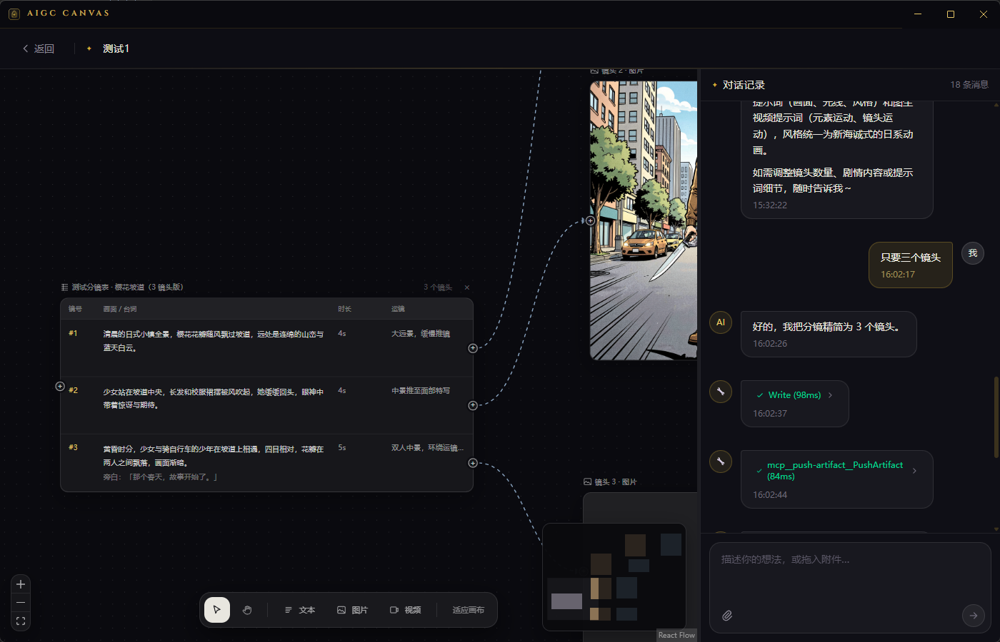
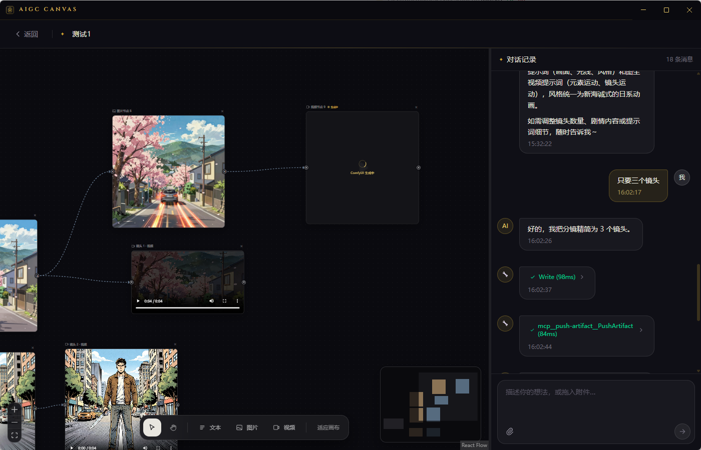
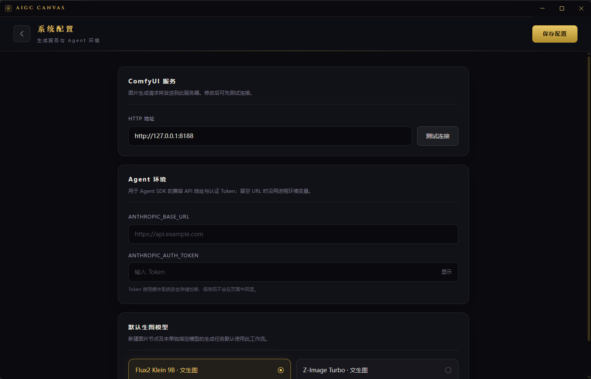

# AIGC CANVAS

[English](README.md) | 简体中文

AIGC CANVAS 是一个面向 AI 分镜与视频创作的 Electron 桌面工作台。它将 Claude Agent、React Flow 无限画布和 ComfyUI 生成管线放在同一个项目工作区中：通过对话生成分镜，在画布上连接图片与视频节点，并直接完成文生图、图生图和图生视频。

## 核心能力

- **Agent 项目助手**：基于 @anthropic-ai/claude-agent-sdk，可在项目目录内读写文件，并通过自定义 PushArtifact 工具把产物推送到画布。
- **React Flow 无限画布**：支持缩放、平移、框选、多选、拖拽、删除和贝塞尔连接线，画布快照按项目持久化。
- **多种节点**：支持文本、图片、视频和分镜表节点；图片连接视频后，图片自动作为图生视频首帧引用。
- **分镜流水线**：.storyboard.json 的每个镜头自动展开为“分镜行 → 图片节点 → 视频节点”，提示词和生成结果会写回源文件。
- **ComfyUI 图片生成**：支持文生图、图生图、16:9 / 1:1 / 4:3 画幅以及 RTX 2× ULTRA 放大。
- **ComfyUI 视频生成**：支持 LTX 2.3 图生视频、首帧引用、RTX 2× ULTRA 放大和 5s / 10s / 15s 时长。
- **媒体预览**：图片直接展示，生成的视频可以在画布节点内播放；工作区协议支持视频 Range 流式读取。
- **系统配置**：可配置 ComfyUI 地址、Agent API 地址与 Token，以及默认文生图工作流。Token 使用 Electron 系统安全存储加密。
- **项目持久化**：聊天记录、画布布局、节点参数和生成产物均按项目保存。

## 创作流程

1. 新建项目并选择本地工作目录。
2. 在右侧对话中让 Agent 创建 .storyboard.json 分镜表。
3. 每个镜头自动连接图片节点和视频节点。
4. 编辑图片提示词并选择工作流、画幅，点击“生成”。
5. 在视频节点中填写动作与运镜提示词，选择时长并生成视频。
6. 生成文件保存在项目的 generated/images 和 generated/videos 目录。

## 内置 ComfyUI 工作流

| 工作流 | 类型 | RTX 放大 |
|---|---|---|
| Flux2 Klein 9B | 文生图 | 2× ULTRA |
| Flux2 Klein 9B Edit | 图生图 | 2× ULTRA |
| Z-Image Turbo | 文生图 | 2× ULTRA |
| LTX 2.3 22B | 图生视频 | 2× ULTRA |

工作流模板位于 resources/comfyui-workflows/。ComfyUI 服务端需要提前安装模板所使用的模型和自定义节点。

## 系统配置

首页右上角进入系统配置，可设置：

- ComfyUI HTTP 地址，例如 http://127.0.0.1:8188
- ANTHROPIC_BASE_URL
- ANTHROPIC_AUTH_TOKEN
- 默认文生图工作流

## 快速开始

环境要求：Node.js、npm、可访问的 ComfyUI 服务，以及 Claude Agent 凭证或兼容 Anthropic API 的 URL 与 Token。

~~~powershell
npm install
npm run dev
~~~

生产构建：

~~~powershell
npm run build
~~~

## 可用脚本

- npm run dev：启动 Vite 与 Electron 开发环境
- npm run build：构建并通过 electron-builder 打包
- npm run typecheck：执行 TypeScript 类型检查
- npm test：执行 Vitest 测试
- npm run test:e2e：执行 Playwright Electron 端到端测试

## 项目结构

~~~text
├── electron/
│   ├── main/
│   │   ├── ipc/                    # 项目、聊天、画布、产物、ComfyUI、配置 IPC
│   │   └── services/
│   │       ├── agent/              # Claude Agent SDK 与 PushArtifact
│   │       ├── comfyui.service.ts  # 图片/视频工作流与产物下载
│   │       ├── settings.service.ts # 全局配置与 Token 安全存储
│   │       └── project.store.ts    # 项目、聊天和画布持久化
│   └── preload/                    # electronAPI 安全桥接
├── resources/comfyui-workflows/    # ComfyUI API 工作流模板
├── src/
│   ├── components/CanvasArea.tsx   # React Flow 画布与生成节点
│   ├── pages/                      # 首页、项目页、设置页
│   ├── shared/                     # IPC 通道与类型
│   └── stores/                     # Zustand 状态
└── test/
~~~

## 分镜数据

分镜文件是 StoryboardShot 数组，包含镜号、时长、场景、台词、运镜、文生图提示词、图生视频提示词，以及图片/视频当前路径和历史版本。节点生成成功后，产物路径会自动写回分镜文件。

## 后续规划

- 更多 ComfyUI 视频工作流
- 镜头批量生成与队列管理
- 分镜视频拼接、配音和导出剪辑
- 工作流模板的可视化导入与字段映射
